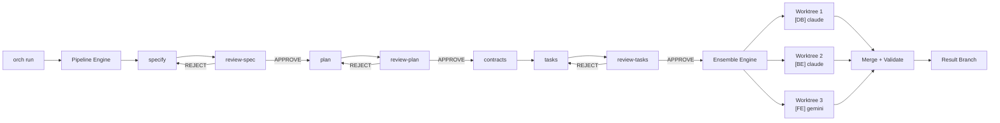

# Undrlla AI - Multi-Model AI Orchestrator

Coordinate multiple AI coding assistants (Claude Code, Gemini CLI, GitHub Copilot CLI, OpenCode, Qwen) through a structured pipeline that generates specs, reviews them, creates implementation contracts, and dispatches parallel coding tasks across isolated git worktrees.

## Features

- **Pipeline engine** -- sequential specify, review, plan, contracts, tasks stages with automatic retry on rejection
- **Ensemble engine** -- parallel task execution across multiple AI tools in isolated git worktrees
- **Contract-first approach** -- shared TypeScript/OpenAPI contracts prevent semantic conflicts between parallel agents
- **5 tool adapters** -- Claude Code, Gemini CLI, GitHub Copilot CLI, OpenCode (Ollama/local), Qwen Code
- **Dependency graph** -- tasks execute in correct order with cascade failure handling
- **MCP server** -- use the orchestrator as a tool inside Claude Code
- **Web dashboard** -- optional React UI with real-time SSE progress (port 3000)
- **SQLite tracking** -- every run, stage, task, and worktree tracked in `~/.orch/orch.db`
- **Dry-run mode** -- preview the full execution plan without spawning any processes

## Architecture



## Prerequisites

| Requirement | Version | Notes |
|-------------|---------|-------|
| Node.js | 22+ (LTS) | Required |
| Git | 2.x | Required (worktree support) |
| AI CLI tool | any 1 of 5 | At least one must be installed |

### AI CLI Tool Installation

| Tool | Install Command | Requires |
|------|----------------|----------|
| Claude Code | `npm install -g @anthropic-ai/claude-code` | Anthropic API key |
| Gemini CLI | `npm install -g @google/gemini-cli` | Google account |
| Copilot CLI | `npm install -g @github/copilot` | GitHub Copilot Pro+ |
| OpenCode | Binary from [opencode.ai](https://opencode.ai) | Go runtime or binary; Ollama for local models |
| Qwen Code | Alibaba's installer | Alibaba Cloud account |

## Quick Start

### 1. Install

```bash
cd packages/orchestrator
npm install
npm link   # makes 'orch' available globally
```

### 2. Configure

```bash
cp orch.config.example.yaml orch.config.yaml
```

Edit `orch.config.yaml` -- enable the tools you have installed and disable the rest. At minimum, one tool must have `enabled: true`.

### 3. Verify tools

```bash
orch tools list
# Shows enabled tools with check/cross status

orch tools test claude
# claude (healthy, 1234ms)
```

### 4. Dry run

```bash
cd /path/to/your/project
orch run "Add user authentication with JWT" --dry-run
```

Output:

```
Pipeline Plan:
  1. specify       -> claude
  2. review-spec   -> gemini
  3. plan          -> claude
  4. review-plan   -> gemini
  5. contracts     -> claude
  6. tasks         -> claude
  7. review-tasks  -> gemini

Ensemble Plan (based on task agent tags):
  [BE]     -> claude
  [FE]     -> gemini
  [DB]     -> claude

No processes spawned (dry-run mode).
```

### 5. Real run

```bash
orch run "Add user authentication with JWT"
```

The orchestrator will:

1. Generate a spec, have it reviewed (retry on rejection)
2. Generate a plan, have it reviewed
3. Generate shared contracts (TypeScript interfaces, API schemas)
4. Parse tasks with dependency graph
5. Spawn parallel AI tools in isolated git worktrees
6. Merge all worktrees, run build validation
7. Output result on branch `orch/run-<id>`

## Speckit Integration

The orchestrator integrates with the [speckit](../../.specify/) workflow. If you already have artifacts from `/speckit.specify`, `/speckit.plan`, or `/speckit.tasks`, the orchestrator can resume from where you left off instead of regenerating everything.

### Resume mode

```bash
# Auto-detect: finds spec.md + plan.md in the spec dir, skips to contracts stage
orch run "Add user auth" --spec-dir specs/001-auth/

# Explicit: start from a specific stage
orch run "Add user auth" --from contracts --spec-dir specs/001-auth/

# Full pipeline from scratch (default, no flags)
orch run "Add user auth"
```

Detection logic:

- `tasks.md` exists --> skip to `review-tasks`
- `plan.md` exists --> skip to `contracts`
- `spec.md` exists --> skip to `plan`

### Template injection

When generating artifacts, the orchestrator looks for speckit templates in `.specify/templates/` and injects them as system prompts. This ensures generated specs, plans, and tasks follow the project's standard format.

| Stage | Template File | Effect |
|-------|--------------|--------|
| `specify` | `spec-template.md` | Spec follows user story format with priorities |
| `plan` | `plan-template.md` | Plan includes technical context, constitution check |
| `tasks` | `tasks-template.md` | Tasks have agent tags, dependency graph, parallel lanes |

Templates are searched in `./`, `../`, and `../../` relative to the project directory (supports monorepo layouts).

## CLI Reference

| Command | Description | Key Flags |
|---------|-------------|-----------|
| `orch run "<description>"` | Start a new orchestration run | `--dry-run`, `--tools <list>`, `--from <stage>`, `--spec-dir <path>` |
| `orch status [run-id]` | Show run status (latest if omitted) | |
| `orch tools list` | List registered tools with status | |
| `orch tools test <name>` | Health-check a specific tool | |
| `orch config get <key>` | Read config value (dot notation) | |
| `orch cleanup` | Remove orphaned worktrees | `--force`, `--max-age <hours>` |
| `orch stats` | Show per-tool performance metrics | |
| `orch nuke` | Hard reset: remove all worktrees, reset state | |
| `orch mcp-serve` | Start MCP server for Claude Code integration | `--port <port>` |

## Configuration

The orchestrator merges two YAML config files at runtime:

1. **Global**: `~/.orch/config.yaml` -- tool registry, shared defaults
2. **Local**: `./orch.config.yaml` -- project-specific pipeline assignments, build commands

Local values override global values. Both files use the same schema.

### Config Structure

```yaml
version: 1                          # Schema version

defaults:
  maxRetries: 3                     # Max retries on review rejection
  timeouts:
    implementation: 300             # Seconds per implementation task
    review: 120                     # Seconds per review stage
  buildCommand: "npm run build"     # Run after merge
  validateCommand: "npx tsc --noEmit"  # Build validation gate

pipeline:                           # Tool assignment per pipeline stage
  specify: claude                   # Who writes the spec
  review-spec: gemini               # Who reviews it
  plan: claude
  review-plan: gemini
  contracts: claude                 # Who generates shared contracts
  tasks: claude                     # Who breaks work into tasks
  review-tasks: gemini

ensemble:                           # Tool assignment per agent tag
  "[BE]": claude                    # Backend tasks
  "[FE]": gemini                    # Frontend tasks
  "[DB]": claude                    # Database tasks
  "[OPS]": gemini                   # DevOps tasks
  "[E2E]": claude                   # End-to-end test tasks
  "[SEC]": claude                   # Security tasks

tools:                              # Tool definitions
  claude:
    command: claude                  # Shell command to invoke
    headlessFlags:                   # Flags for non-interactive mode
      - "-p"
      - "--permission-mode"
      - "bypassPermissions"
      - "--output-format"
      - "stream-json"
    strengths: [backend, review, spec, security]
    priority: 1                      # Lower = preferred when auto-assigning
    provider: anthropic
    enabled: true
```

All config values are validated at load time with Zod. Invalid config produces a clear error with the specific field that failed.

## Supported Tools

| Tool | Command | Provider | Headless Flags | Strengths | Output Format |
|------|---------|----------|---------------|-----------|---------------|
| Claude Code | `claude` | Anthropic | `-p --permission-mode bypassPermissions --output-format stream-json` | backend, review, spec, security | stream-json |
| Gemini CLI | `gemini` | Google | `-p -y` | frontend, review, spec | text |
| Copilot CLI | `copilot` | GitHub | `-p --yolo --output-format json` | backend, frontend, review | json |
| OpenCode | `opencode` | Local (Ollama) | `run --format json` | backend, database, devops | json |
| Qwen Code | `qwen-code` | Alibaba | `--non-interactive` | backend, database | text |

### OpenCode with local models

OpenCode supports 75+ providers including Ollama for fully local execution:

```bash
# In orch.config.yaml, add model flag:
opencode:
  command: opencode
  headlessFlags: ["run", "--model", "ollama/deepseek-coder-v2", "--format", "json"]
  enabled: true
```

Requires Ollama running locally (`ollama serve`).

## MCP Server

The orchestrator exposes itself as an MCP server for use inside Claude Code.

### Setup

Add to your Claude Code MCP configuration:

```json
{
  "mcpServers": {
    "orch": {
      "command": "orch",
      "args": ["mcp-serve"]
    }
  }
}
```

### Available MCP Tools

| Tool | Description |
|------|-------------|
| `orch.run` | Start a new orchestration run |
| `orch.status` | Get run status |
| `orch.dispatch_task` | Dispatch a single task to a specific tool |
| `orch.merge` | Trigger merge and validation |
| `orch.tools_list` | List registered tools and health |
| `orch.cleanup` | Purge orphan worktrees |

### Usage from Claude Code

```
> Use the orch tool to run "Add user authentication with JWT"
```

## Web Dashboard

An optional React web UI provides real-time progress monitoring via Server-Sent Events.

- **URL**: `http://localhost:3000`
- **Views**: pipeline progress, parallel lane status, dependency graph, run history, tool leaderboard
- **Data flow**: Engine events --> EventBus --> SSE --> React UI

### Running with Docker

The orchestrator runs **natively** on the host (it needs access to CLI tools, git, and auth tokens). Docker is used only for the web dashboard:

```bash
# 1. Start the orchestrator API on the host
orch mcp-serve --port 3001

# 2. Start the web dashboard in Docker
docker compose up -d

# Dashboard at http://localhost:3000 proxies to host API at :3001
```

Why not containerize the orchestrator itself:

- MCP server uses stdin/stdout pipes -- must be on the same host as Claude Code
- CLI tools (claude, gemini, copilot) have host-level auth tokens in `~/.claude`, `~/.config`
- Git worktrees require host filesystem access
- LLM servers (LM Studio, Ollama) use host GPU

```
HOST:  orch + CLI tools + LLM servers (LM Studio :1234, Ollama :11434)
         |
         :3001 (HTTP API)
         |
DOCKER:  web dashboard :3000  -->  proxy to host:3001
```

## Development

### Build

```bash
npm run build       # Compile TypeScript
npm run dev         # Watch mode
```

### Test

```bash
npm run test        # All tests (Vitest)
npm run test:unit   # Unit tests only
npm run test:integration  # Integration tests only
```

### Lint

```bash
npm run lint        # TypeScript type-check (tsc --noEmit)
```

### Clean

```bash
npm run clean       # Remove dist/
```

### Project Structure

```
packages/orchestrator/
  src/
    index.ts              # CLI entry (Commander)
    types.ts              # Core type definitions
    config/               # YAML loader + Zod schema
    registry/             # Tool CRUD + health checks
    engine/               # Pipeline, ensemble, contracts, merger, scheduler
    process/              # execa spawning, output filtering, watchdog
    events/               # Typed EventBus (eventemitter3)
    worktree/             # Git worktree management + scope guard
    db/                   # SQLite schema + CRUD (better-sqlite3)
    mcp/                  # MCP server + tool definitions
    api/                  # Hono HTTP server + SSE routes
    parsers/              # Task and review output parsers
    utils/                # Logger (pino), errors, git helpers
  tests/
    unit/
    integration/
  web/                    # React dashboard (Phase 2)
```

## License

MIT
