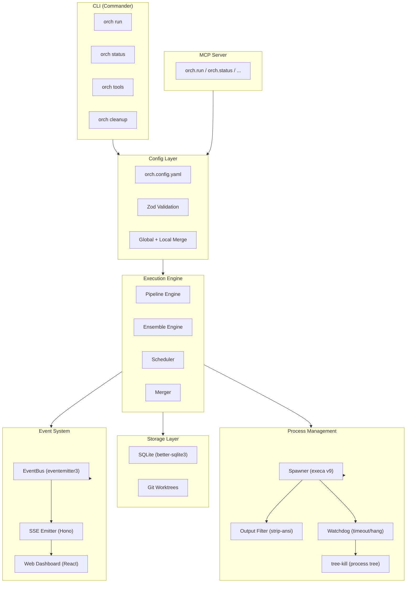
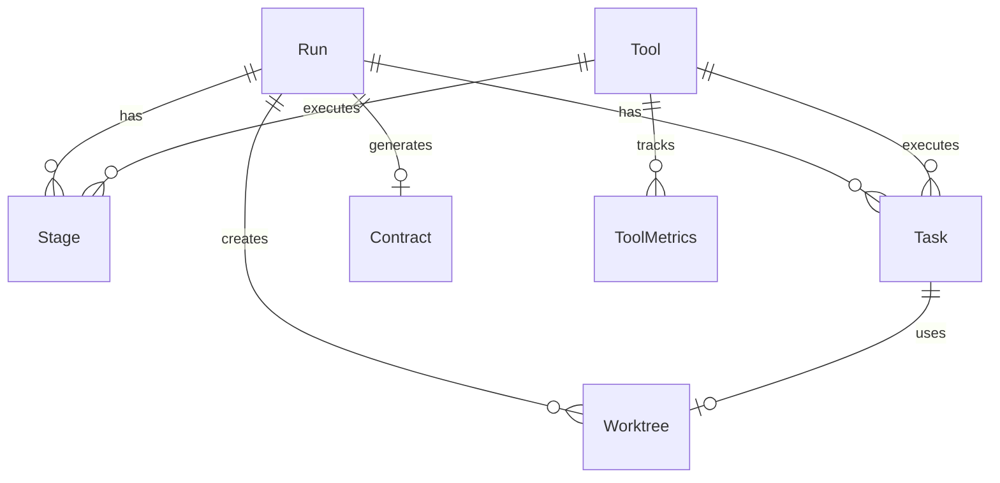

# Architecture: Multi-Model AI Orchestrator

## Overview

### The Problem

AI coding assistants are powerful individually, but each has different strengths. Claude excels at architecture and security reasoning. Gemini is strong at frontend and review. Copilot integrates tightly with GitHub workflows. Local models via Ollama provide privacy and cost control.

No single tool is best at everything. Developers manually switch between tools, losing context and consistency.

### The Solution

The orchestrator treats AI coding tools as a fleet of workers. It breaks a feature request into a structured pipeline (specify, review, plan, implement), generates shared contracts so parallel workers don't conflict, dispatches tasks to the best-fit tool, and merges results into a single branch.

Each worker is a real CLI tool with full file editing capability -- not an API wrapper. Workers run in isolated git worktrees so they cannot interfere with each other.

## System Diagram



## Pipeline Engine

The pipeline is a sequential, multi-stage process that transforms a natural language description into a set of concrete, reviewable implementation tasks.

### Stages

| # | Stage | Purpose | Output Artifact |
|---|-------|---------|-----------------|
| 1 | `specify` | Generate a detailed feature specification | `spec.md` |
| 2 | `review-spec` | Review the spec for completeness and correctness | APPROVE or REJECT |
| 3 | `plan` | Generate an implementation plan from approved spec | `plan.md` |
| 4 | `review-plan` | Review the plan for feasibility | APPROVE or REJECT |
| 5 | `contracts` | Generate shared TypeScript/OpenAPI contracts | `contracts/*.ts` |
| 6 | `tasks` | Break the plan into tagged, parallelizable tasks | `tasks.md` |
| 7 | `review-tasks` | Review task breakdown for completeness | APPROVE or REJECT |

### Rejection Loop

Review stages produce either APPROVE or REJECT with feedback. On rejection:

1. The feedback is appended to the original prompt
2. The generation stage re-runs (e.g., `specify` reruns after `review-spec` rejects)
3. Retries continue up to `defaults.maxRetries` (default: 3)
4. If max retries exceeded, the run fails

```
specify --> review-spec --APPROVE--> plan
                |
                REJECT (with feedback)
                |
                v
            specify (retry, attempt 2)
```

### Tool Assignment

Each stage has a tool assigned in `pipeline` config. The common pattern is to use one tool for generation (e.g., Claude) and a different tool for review (e.g., Gemini) to get independent evaluation.

### Speckit Integration

The pipeline integrates with the project's speckit workflow (`.specify/`). Two mechanisms:

**Resume mode** (`--from`, `--spec-dir`): If speckit artifacts already exist (from manual `/speckit.specify`, `/speckit.plan`, `/speckit.tasks` commands), the pipeline auto-detects them and skips completed stages. Detection checks `tasks.md` > `plan.md` > `spec.md` in the spec directory, resuming from the first missing artifact.

```
Existing artifacts:     Resume point:
  spec.md               --> skip specify + review-spec, start at plan
  spec.md + plan.md     --> skip specify..review-plan, start at contracts
  spec.md + plan.md     --> skip specify..review-tasks, start at ensemble
    + tasks.md
```

**Template injection**: Generation stages (specify, plan, tasks) look for matching templates in `.specify/templates/` and inject them as system prompts. This ensures AI-generated artifacts follow the project's standard format (user story structure, agent tags, dependency graph format).

### Deployment Architecture

```
HOST (native):
  orch mcp-serve        <-- MCP server (stdin/stdout to Claude Code)
  orch run --port 3001  <-- HTTP API for web dashboard
  claude / gemini / copilot / opencode  <-- CLI tools with auth
  LM Studio :1234 / Ollama :11434      <-- local LLM servers

DOCKER (optional):
  web dashboard :3000   <-- React UI, proxies /api to host:3001
```

The orchestrator must run natively because: MCP uses stdin/stdout pipes, CLI tools need host auth tokens, git worktrees need host filesystem, and LLM servers use host GPU. Docker is used only for the web dashboard.

## Ensemble Engine

The ensemble engine executes implementation tasks in parallel. Each task runs in its own git worktree with its own AI tool instance.

### Worktree Isolation

1. For each task, create a new git worktree from the current branch
2. Symlink `node_modules` to avoid redundant installs
3. Copy shared contracts (read-only) into the worktree
4. Generate `ORCHESTRATOR_INSTRUCTIONS.md` with task context and contract references
5. Spawn the assigned CLI tool in the worktree directory

```
project/
  .git/worktrees/
    orch-run-abc123-T001/    # [DB] task -> claude
    orch-run-abc123-T002/    # [BE] task -> claude
    orch-run-abc123-T003/    # [FE] task -> gemini
```

### Dependency Graph

Tasks can declare dependencies. The scheduler builds a DAG and determines execution order:

- **Root tasks** (no dependencies) start immediately in parallel
- **Dependent tasks** wait until all blockers complete
- **Cascade failure**: if a task fails, all tasks that depend on it move to `blocked`
- **Critical path**: the scheduler identifies the longest dependency chain for progress estimation

### Lane Assignment

Tasks are grouped into parallel lanes by agent tag. Each lane processes its tasks sequentially (within the lane) but all lanes run concurrently:

```
Lane 1: [DB]  T001 -> T004 (sequential within lane)
Lane 2: [BE]  T002 -> T005 (depends on T001 completing)
Lane 3: [FE]  T003         (independent)
```

### Merge and Validation

After all tasks complete (or fail):

1. Merge each completed worktree branch into a result branch (`orch/run-<id>`)
2. If merge conflicts occur, attempt auto-resolution; record unresolvable conflicts
3. Run `defaults.buildCommand` (e.g., `npm run build`)
4. Run `defaults.validateCommand` (e.g., `npx tsc --noEmit`)
5. Report results: branch name, conflict count, validation pass/fail

## Process Management

### Spawning

All CLI tools are spawned via `execa` v9 in headless mode. No pseudo-terminal (PTY) is needed because all five supported tools have native `--print` or equivalent flags.

```
execa(tool.command, [...tool.headlessFlags, prompt], {
    cwd: worktreePath,
    timeout: config.defaults.timeouts.implementation * 1000,
    forceKillAfterDelay: 5000,
})
```

**Why execa over node-pty**: All tools support headless mode natively. execa has zero native dependencies, works identically on Windows/Linux/macOS, and provides built-in timeout and graceful kill support. node-pty requires node-gyp compilation and is fragile on Windows. (Research decision R2.)

### Output Filtering

CLI tools produce output with ANSI escape codes, cursor movement sequences, and spinner redraws. The output filter chain:

1. **strip-ansi** -- removes ANSI color/style codes
2. **Custom cursor filter** -- strips cursor movement (`\x1b[?25l`, `\x1b[K`, etc.) and carriage returns used by spinners
3. **LineBuffer** -- accumulates partial lines, emits complete lines for semantic extraction

The clean output is stored in the database and forwarded to the event bus.

### Watchdog

Each spawned process has a watchdog that monitors for:

- **Timeout**: no completion within `defaults.timeouts.implementation` seconds
- **Hang detection**: no stdout output for a configurable interval (indicates the tool is stuck)

On timeout or hang:
1. Send SIGTERM to the process
2. Wait `forceKillAfterDelay` (5s)
3. If still alive, use `tree-kill` to kill the entire process tree (handles grandchild processes like git, npm, tsc that CLI tools spawn)

## Data Model

### Storage

SQLite via `better-sqlite3` in WAL mode. Location: `~/.orch/orch.db` (user-level, shared across projects). Runs are scoped to projects via `project_dir` column.

WAL mode is required because the web dashboard reads the database concurrently with the engine writing to it. Without WAL, this would produce `database is locked` errors.

### Entities

| Entity | Purpose | Key Fields |
|--------|---------|------------|
| **Run** | Top-level orchestration session | id, description, status, project_dir, result_branch |
| **Stage** | Single pipeline step | run_id, type, tool_name, status, attempt, duration_ms |
| **Task** | Single implementation unit | id (T001), agent_tag, tool_name, status, worktree_path, lane |
| **Tool** | Registered CLI tool | name, command, headless_flags, strengths, priority, enabled |
| **ToolMetrics** | Aggregated performance stats | tool_name, stage_type, avg_duration_ms, success_rate |
| **Contract** | Shared interface file | run_id, format (typescript/openapi), file_path, locked_at |
| **Worktree** | Git worktree lifecycle | run_id, task_id, path, branch, status |

### Entity Relationships



### State Machines

**Run**:
```
pending -> pipeline -> contracts -> ensemble -> merging -> validating -> completed
     \         \           \           \           \            \--------> failed
      \         \           \           \           \--------------------> failed
       \         \           \           \------------------------------> failed
        \         \           \-----------------------------------------> failed
         \         \---------------------------------------------------> failed
          \------------------------------------------------------------> failed
```

**Stage**:
```
pending -> running -> approved
                   -> rejected -> running (retry) -> approved | failed
                   -> failed
```

**Task**:
```
pending -> running -> completed
                   -> failed -> (dependents become blocked)
```

**Worktree**:
```
active -> completed (merged)
       -> failed (task failed)
       -> abandoned (process crashed)
```

## Event System

The orchestrator uses a typed event bus to decouple the execution engine from consumers (CLI output, SSE stream, web dashboard).

### Flow

```
Engine (pipeline/ensemble) --> EventBus (eventemitter3) --> CLI stdout
                                                       --> SSE endpoint (/api/runs/:id/events)
                                                       --> Web UI (React, useSSE hook)
```

### Event Types

| Event | Emitted When | Payload |
|-------|-------------|---------|
| `run:started` | New run begins | run id, description |
| `stage:started` | Pipeline stage begins | stage id, type, tool name |
| `stage:completed` | Pipeline stage finishes | stage id, status, duration |
| `task:started` | Ensemble task begins | task id, agent tag, tool name, lane |
| `task:output` | Tool produces stdout line | task id, line text |
| `task:completed` | Task finishes | task id, status, duration |
| `merge:started` | Worktree merge begins | run id |
| `merge:completed` | Merge finishes | success, conflicts, validation |
| `run:completed` | Entire run finishes | run id, status, branch |

### SSE Transport

The Hono HTTP server exposes `GET /api/runs/:id/events` as a Server-Sent Events stream. The web dashboard connects to this endpoint and renders real-time progress.

## Config System

### Merge Strategy

Two config files are loaded and merged:

1. **Global** (`~/.orch/config.yaml`) -- tool definitions, API key references, shared defaults
2. **Local** (`./orch.config.yaml`) -- project-specific pipeline assignments, build commands, tool overrides

Merge rules:
- Scalar values: local overrides global
- Arrays: local replaces global (no merge)
- Objects: deep merge (local keys override, global keys preserved)

### Validation

The merged config is validated against a Zod schema at load time. Validation failures produce actionable error messages with the exact path of the invalid field.

```typescript
// Simplified schema structure
const orchConfigSchema = z.object({
  version: z.literal(1),
  defaults: z.object({
    maxRetries: z.number().int().positive(),
    timeouts: z.object({
      implementation: z.number().positive(),
      review: z.number().positive(),
    }),
    buildCommand: z.string(),
    validateCommand: z.string(),
  }),
  pipeline: pipelineSchema,
  ensemble: ensembleSchema,
  tools: z.record(toolConfigSchema),
});
```

## Key Design Decisions

These decisions are documented in detail in `specs/001-orchestrator/research.md`.

| ID | Decision | Rationale |
|----|----------|-----------|
| R1 | Use native `-p`/`--print` headless flags instead of PTY emulation | All 5 tools support headless mode. No need for node-pty complexity and native build deps. |
| R2 | `execa` v9 over `node-pty` for process spawning | Zero native dependencies, cross-platform, built-in timeout. PTY is unnecessary given R1. |
| R3 | `better-sqlite3` (raw SQL) over Drizzle ORM | Synchronous API suits CLI tools. Schema is 7 tables -- simple enough for raw SQL. Migrate to Drizzle if schema exceeds ~10 tables. |
| R4 | `@modelcontextprotocol/sdk` for MCP server | Official SDK with stdio and SSE transports. Direct integration with Claude Code. |
| R5 | `strip-ansi` + `tree-kill` for output filtering and process cleanup | strip-ansi handles ANSI codes. tree-kill handles grandchild processes that execa's built-in kill misses. |
| R6 | Hono for HTTP/SSE server | 14KB, TypeScript-native, built-in `streamSSE`. Lightest option for an optional web dashboard. |
| R7 | Commander.js for CLI framework | Battle-tested, clean subcommand API, good TypeScript support. |
| R8 | YAML for config format | More readable than JSON for nested config with comments. Zod validates at load time. |
